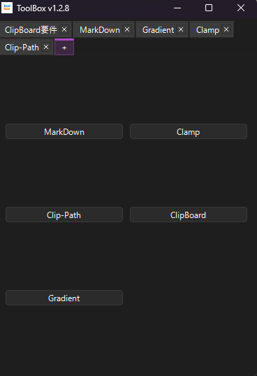
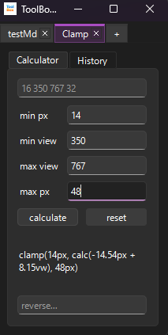
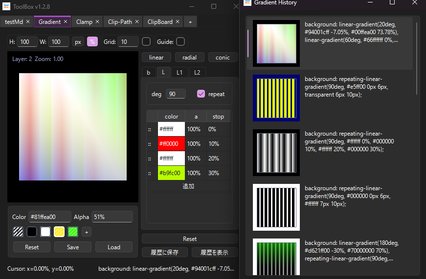

# ToolBox

開発作業やCSS調整などを補助する小型ツールをまとめた
Windows向けを主対象にしたユーティリティ集です。

複数のツールをタブで切り替えながら使用できます。

## Screenshot

`[+]` タブ



Clampタブ



Gradientタブ



## Features

- タブ単位でツールを管理
- タブ状態の自動保存
- ツール単位での設定/履歴保存
- 自動アップデート対応
- ポータブル構成（AppData未使用）

## 使用方法

1. [Releases](https://github.com/atachan14/ToolBox/releases)から最新版をダウンロードし、zipを解凍してください。
2. 中に入っているToolBox.exeを起動してください。

注記:
- 未確認のアプリケーションとして警告が出る場合があります。
- Smart App Control が有効な環境では起動できない場合があります。

起動後は自動で `[+]` タブが開かれます。  
`[+]` タブ内の各ツールをクリックすることで対象ツールを開き、タブに追加します。  
`[+]` タブ内の各ツール、または開いたツールのタブを右クリックすることでメニューを開き、メニューからヘルプを起動できます。

各ツールの使用法については各ヘルプを参照してください。

## 使用方法（その他）

- タブを右クリックして表示されるメニューから、タブの削除やリネームが行えます。対象タブにカーソルを合わせて `F2` キーでもリネームが行えます。
- `Alt+W` でウィンドウを最前面に固定できます。Windows では Win32 API を使い、その他の環境では Qt 標準機能にフォールバックします。
- `[+]` タブを右クリックしたメニューから、閉じたタブの復元が行えます。
- Release 更新時はダイアログが表示され、自動更新が可能になっています。

## Included Tools

詳細についてはアプリケーション内の各ヘルプを参照してください。

### MarkDown

シンプルな Markdown エディタです。
主に簡易メモとしての使用を想定して制作しています。

### Clamp

CSS の `clamp(...)` を作るための計算ツールです。

### Clip-Path

CSS の `clip-path: polygon(...)` を組み立てるツールです。

### ClipBoard

定型文やテキスト断片を保存して再利用するためのツールです。

### Gradient

CSS グラデーションを視覚的に作るツールです。

## Environment

Runtime

- Windows
- macOS / Linux: 実機確認無し。最前面表示は Qt 標準機能で動作。

Development

- Python 3.14
- PySide6
- pywin32 (Windows only)

## Run

```powershell
python main.py
```

## Build

`build.ps1` で PyInstaller ビルドを実行します。

```powershell
./build.ps1
```

ビルド後の想定:
- `dist/ToolBox/_internal/`
- `dist/ToolBox/ToolBox.exe`
- `dist/ToolBox/updater.exe`

## Project Structure

```text
.
├─ core/        # アプリ共通機能
├─ tools/       # 各ツール本体
├─ Users/       # ユーザーデータ
├─ main.py      # アプリ起動
├─ updater.py   # 更新用処理
├─ build.ps1    # ビルドスクリプト
└─ README.md
```

## Data Persistence

このアプリはツールごとのデータやタブ状態を保存します。

```text
Users/
├─ Tabs/       タブ毎のデータ
├─ ToolData/   ツール共有のデータ
└─ TrashTabs/  閉じたタブのデータ
```

`Tabs/` 内のフォルダ名はアプリケーション内のタブ名と一致します。  
そのためフォルダ単位でタブ状態を管理できるポータブル構成になっています。

## Roadmap / Notes

- Help の最適化
- 各Tool の UI/UX の最適化
- ツールの追加
- ツールのパッケージ化/プラグイン化

## License

MIT License

## 制作経緯

事業所でのclamp計算を楽にしたいという思いから始まり、ついでの機能を構想し、自分用のアプリケーションとして開発しました。
またポートフォリオとしても活用できるよう、自分以外の使用を想定したHelpの追加やUIの調整、自分のためだけなら過剰だが誰かにとっては必要そうな機能を追加しました。

## AI

v1.0.0まで（MarkDown と Clamp）は ChatGPT と共同で制作しており、それ以降は殆どを Codex に制作させています。
