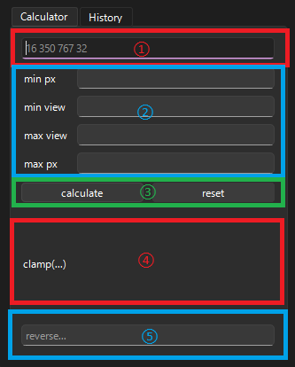

# Clamp Help

数値から CSS の `clamp(...)` を作るツールです。  
Calculator と History の 2 タブで構成されています。

## Calculator



### ① まとめて入力

次の順で 4 つの値を入れます。
それぞれの値はスペースかカンマで区切ってください。

- `min px`
- `min view`
- `max view`
- `max px`

例:

```text
16 350 767 32
16,350,767,32
16,350 767, 32
```

計算すると、②のフォームにも値が反映されます。

### ② 個別入力

フォームに以下を個別に入力して計算します。

- `min px`
- `min view`
- `max view`
- `max px`

### ⑤ 逆算

下部の `reverse...` に既存の `clamp(...)` を入れると、各値を逆算してフォームへ戻します。

## 出力

- 計算が成功すると、結果は下部に表示されます。
- 結果は自動でクリップボードにコピーされます。
- 結果ラベルをクリックしても再コピーできます。

## History

- 計算成功時の結果は自動で履歴に追加されます。
- 履歴をクリックすると、その `clamp(...)` をコピーしつつ、対応する数値を Calculator に戻します。

## ショートカット

- `Enter`: 現在フォーカス中の入力方法で実行
- `Ctrl + Delete`: 全入力をリセット

## 補足

- どの入力欄を最後に触ったかで、`calculate` ボタンの対象が変わります。
- 無効な値や解釈できない `clamp(...)` はエラー表示になります。
