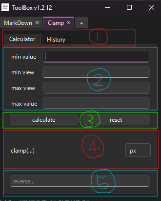
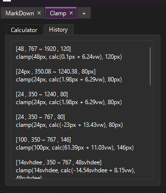

# Clamp Help

数値から CSS の `clamp(...)` を作るツールです。  
Calculator と History の 2 タブで構成されています。

## Calculator

1. ②に値を入れてください。
2. Enterキーを押すか、あるいは③のcalculateをクリックしてください。
3. ④に計算結果が表示されます。

＿

各入力フォームはTab/Shift+Tabで移動可能です。

### ① Calculator / History Tab

クリックでTabを切り替えます。

### ② Input Form

フォーム毎に値を入力します。

### ③ calculation / reset

#### calculation

最後にフォーカスした入力欄に応じて、Input Form または Reverse を計算します。

計算完了時処理

- resultに計算結果が表示される。
- クリップボードに値がコピーされる。
- historyに計算結果が登録される。

＿

ショートカットキー：Enter

#### reset

全入力フォームの値をリセットします。

＿

ショートカットキー：Ctrl+Delete

### ④ result

計算結果が表示されます。

クリックで再コピーが可能です。

### ⑤ Reverse

下部の `reverse...` に既存の `clamp(...)` を入れると、各値を逆算してフォームへ戻します。

主に、既存コードの view range を調べるために使用します。

## History

各アイテムをクリックすると、対象の計算結果をコピーしつつ、対応する数値を Calculator に戻します。
