# Gradient Help

CSS の `background` 用グラデーションを視覚的に作るツールです。  
現在は `linear-gradient` を中心に編集できます。

## 画面の構成
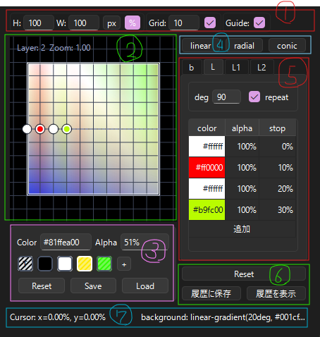

1. ヘッドバー

2. キャンバス

3. パレット

4. レイヤー追加ボタン

5. レイヤータブ / レイヤービュー

6. リセット / 履歴を保存 / 履歴を表示

7. フットバー

### ① ヘッドバー
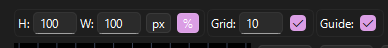

キャンバスでのプレビューや入力補助の設定です。

出力されるコードには影響しません。

#### サイズ
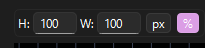

要素のサイズとサイズの単位を設定します。

単位が `%` の場合、`H` と `W` は `aspect-ratio` として機能します。

#### グリッド
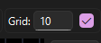

グリッドの表示 / 非表示と、その間隔を設定します。

表示時はキャンバス内での入力がグリッドにスナップされるようになっています。 

#### ガイド
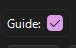

画面範囲を囲うガイド線と、入力した各ストップのマーカーの表示 / 非表示を切り替えます。

### ② キャンバス
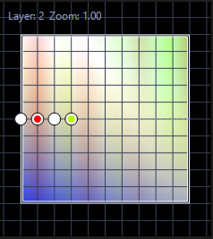

プレビュー兼入力用のキャンバスです。

- 左クリック : ストップを入力。
- 右クリック : ストップを削除。
- 左ドラッグ : ストップを移動。
- Ctrl + スクロール : 拡大 / 縮小
- Ctrl + 左ドラッグ or 中ボタンドラッグ : パンの移動。

＿

Qt のスタイル描画を利用し、疑似的に HTML / CSS を再現しているため、実際のブラウザでの描画とは異なる場合があります。

### ③ パレット
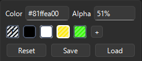

編集用の色一覧です。

各スウォッチを左クリックで選択したり、右クリックでメニューを開いたりしてください。

ストップリストのカラー欄にドラッグすることも可能です。

パレットの状態はタブごとに保存され、`Save` するとツール共通のパレットとして保存されます。

パレット内の `Reset` ボタンは、パレットのみを初期状態に戻します。

### ④ レイヤー追加ボタン
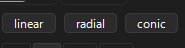

クリックしたタイプのレイヤーをレイヤータブに追加します。

### ⑤ レイヤータブ / レイヤービュー
このツールでは複数のグラデーションを各タブに分け、同時に描画 / 調整できます。

タブの右クリックでメニューが開けます。

#### B. background
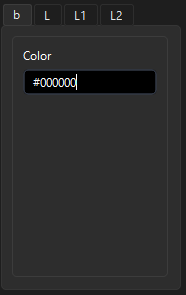

削除不可のレイヤーです。

現在は背景色のみ編集できます。

#### L. linear
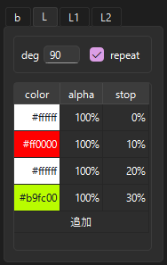

`linear-gradient` です。

##### deg
ストップを配置する方向です。

`linear-gradient` の仕様上、以下のようになっています。
- 0度 : 下から上
- 90度 : 左から右
- 180度 : 上から下
- 270度 : 右から左

##### repeat
チェックを入れると `repeat-linear-gradient` として描画 / 出力します。

##### ストップリスト
レイヤー内に入力されているストップ一覧が表示されます。

各項目は左クリックで値を編集したり、右クリックでメニューを開いたり、ドラッグで順序を入れ替えたりできます。

#### R. radial / C. conic
実装していません。

### ⑥ リセット / 履歴に保存 / 履歴を表示
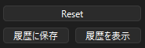

#### リセット
パレット以外を初期状態に戻します。

#### 履歴に保存
パレット以外の状況を履歴に保存します。

保存されたデータはツールで共有されます。ほかのタブや、再度開いたタブからも使用できます。

#### 履歴を表示
履歴ウィンドウを表示します。

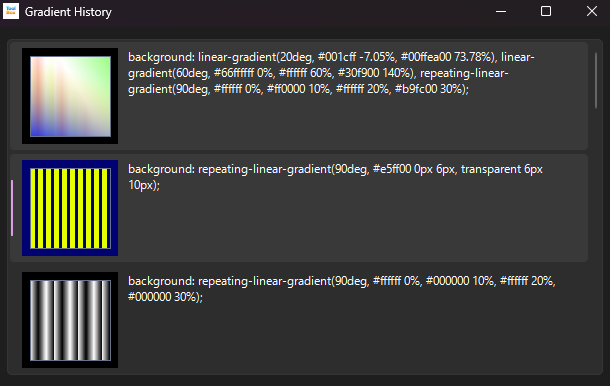

- 左クリック : コードをコピーし、状態を復元します。
- 右クリック : メニューを開きます。履歴の削除が可能です。

### ⑦ フットバー
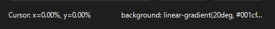

#### Cursor
現在カーソルの座標を表示します。

#### Code
生成されたコードを表示しています。

非表示のレイヤーや非表示のストップは、出力コードから除外されます。

左クリックでコピーし、かつ履歴に保存します。

長いコードはマウスホイールで横スクロールできます。

## ショートカット

- `Ctrl + Z`: Undo
- `Ctrl + Y`: Redo

## チュートリアル

### dotterの制作
執筆予定
